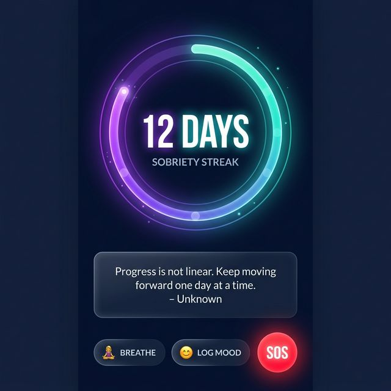
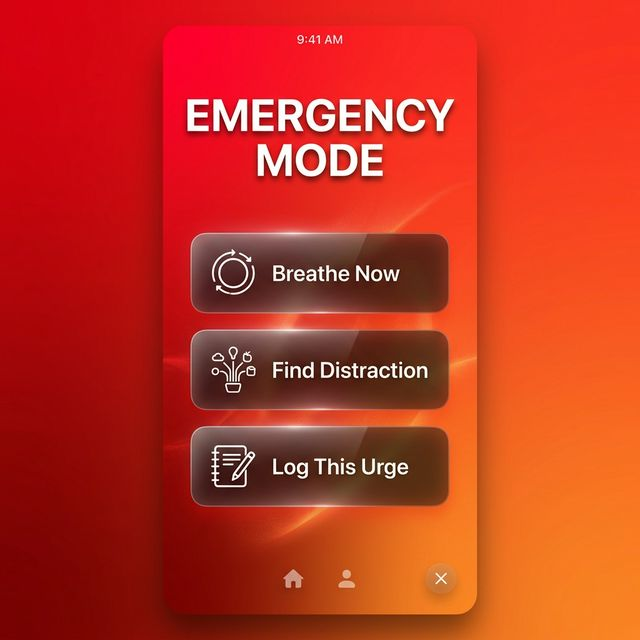
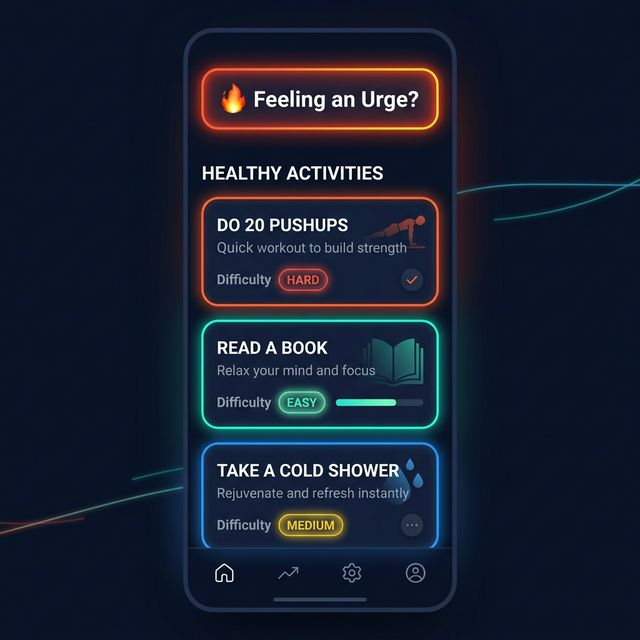
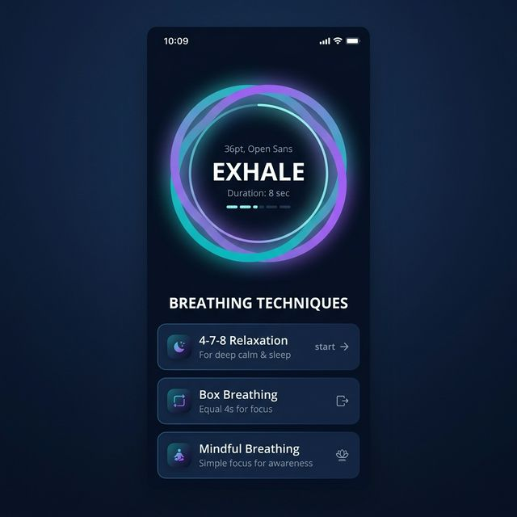
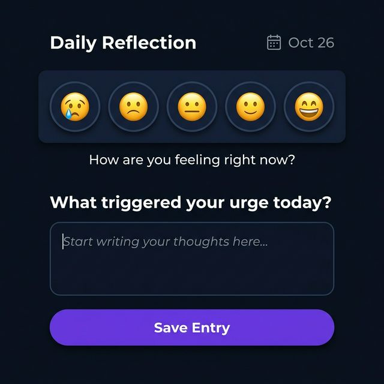
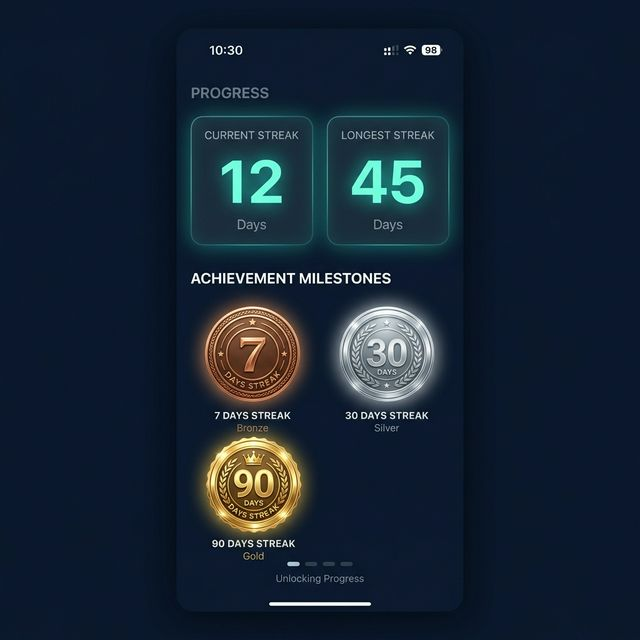

<div align="center">
  
  <h1>🧠 PureMinds</h1>
  <p><strong>Break free from addiction, rebuild your mind, and reclaim your life.</strong></p>

  <p>
    <a href="https://reactnative.dev/"></a>
    <a href="https://expo.dev/"></a>
    <a href="#"></a>
    <a href="#"></a>
  </p>
</div>

---

## 📖 About

**PureMinds** is an offline-first mobile application built to help individuals control pornography addiction. Instead of just tracking streaks, this app focuses on *redirection*—providing immediate, healthy alternative activities, guided breathing exercises, and emotional journaling to fight off urges the moment they happen.

Because addiction recovery requires absolute privacy, **PureMinds never sends your data to the cloud**. Everything is stored securely on your local device using `AsyncStorage`.

---

## 🚀 Core Features

| Feature | Description |
| :--- | :--- |
| **🔥 Streak Counter** | Large, animated day counter with achievement badges for milestones (7, 30, 90, 365 days). |
| **🚨 Emergency Mode** | A full-screen panic button providing intense haptic feedback and immediate guided distractions to break negative thought loops. |
| **🎨 Activity Redirection** | 30+ curated activities (physical, creative, mindfulness, social) to instantly redirect energy when an urge hits. |
| **🧘 Guided Breathing** | Interactive, animated breathing circles (4-7-8, Box Breathing) to calm the nervous system. |
| **📓 Daily Journal** | Private emoji-based mood tracker and journaling prompts to reflect on triggers and victories. |
| **📈 Progress Analytics** | Track completed healthy activities and longest streaks over time. |

---

## 📸 Screenshots


<div align="center">
  <table>
    <tr>
      <td align="center"><b>Dashboard (Streak)</b></td>
      <td align="center"><b>Emergency Mode</b></td>
      <td align="center"><b>Activity Redirection</b></td>
    </tr>
    <tr>
      <td></td>
      <td></td>
      <td></td>
    </tr>
    <tr>
      <td align="center"><b>Guided Breathing</b></td>
      <td align="center"><b>Daily Journal</b></td>
      <td align="center"><b>Achievements</b></td>
    </tr>
    <tr>
      <td></td>
      <td></td>
      <td></td>
    </tr>
  </table>
</div>

---

## 🛠️ Tech Stack

- **Framework:** React Native (Managed by Expo)
- **Navigation:** `@react-navigation/bottom-tabs`, `@react-navigation/native-stack`
- **Animations:** `react-native-reanimated`, `react-native-svg`
- **Storage:** `@react-native-async-storage/async-storage`
- **Hardware Interaction:** `expo-haptics`
- **Styling:** Custom Design System (Dark mode, gradients, tokens)

---

## 💻 Running the App Locally

To test or modify this application on your own machine:

### 1. Prerequisites
- Node.js installed on your machine
- [Expo Go](https://expo.dev/client) app installed on your iOS or Android device

### 2. Clone the Repository
```bash
git clone https://github.com/brobrocoder48/pureminds-anti-masterbation-application-.git
cd pureminds-anti-masterbation-application-
```

### 3. Install Dependencies
```bash
npm install
```

### 4. Start the Development Server
```bash
npx expo start
```

### 5. Launch the App
Open the **Expo Go** app on your phone and scan the QR code that appears in your terminal. Ensure your phone and computer are on the same Wi-Fi network.

---

## 🔒 Privacy Guarantee

Because trust is essential in recovery:
- **Zero Cloud Sync:** No user accounts, no databases, no cloud APIs.
- **100% On-Device:** All journal entries, completed activities, and streak data remain trapped in your phone's local storage.
- **No Trackers:** No analytics or advertisement SDKs are bundled.

---
<div align="center">
  <i>"Your worst days in recovery are better than your best days in addiction."</i>
</div>
